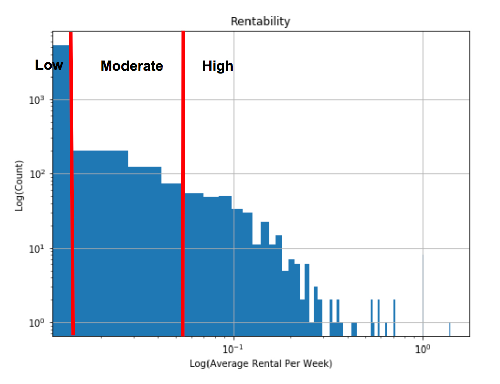

# Borrow My Style

---
## Contents

[**1. Introduction**](#introduction)

[**2. Challenges with the Data**](#data)

[**3. Fun with Feature Engineering**](#feature_engineering)

[**4. Modeling Rentability**](#modeling_rentability)

[**5. Model Performance**](#model_performance)

[**6. The Future Looks Fashionable**](#summary)

**Page under construction. Please have a look through the git repository. The jupyter notebooks are finalized and describe the analysis in greater detail.**

# <a name="introduction">Introduction</a>

Insight Data Science is an intensive postdoctoral training fellowship that bridges the gap between academia and a career in data science. As part of the program, I had the wonderful opportunity to consult with _Borrow My Style_*, a fashion e-commerce startup. My client company provides a peer-2-peer rental community where they wish to enable people to either rent or sell fashion items such as dresses, handbags, as well as shoes and accessories. Currently, the company has no recommendation system in place for lenders so adding will greatly benefit them. The purpose of this blog post is to detail the models that were built to evaluate inventory performance and provide a recommendation system for lenders.

*For the purposes of anonymity, _Borrow My Style_ is a pseudonym for the consulting client.

# <a name="data">Challenges with the Data</a>

[Data cleanining pipeline (notebook)](https://nbviewer.jupyter.org/github/ecampana/borrow-my-style/blob/master/data-cleaning-pipeline.ipynb)

The company is a young start up with a small technical team. They are immensely interested in finding ways to explore the data and extract fashion trends that could help lenders. Their inventory data is stored on a Heroku PostgreSQL database that contained about six thousand sample collect during a three year period. The data contained a small fraction of samples that needed to be removed simply because they did not provide enough information to be of any use. With that in mind, the rest of the data had a wealth of information. The data exploration revealed that much of the inventory is under utilized which really eliminated the possibility of using standard forecasting models to predict inventory trends.

Brand names were curated to remove any variablity in their spellings. This reduced the list of brand names by 30%. More advance techniques, such as Natural Language Processing (NLP), to determine text similarity between brand names could have been used but our main concern regarded brand names that are related but appear with completely different spellings. For example, lenders could list their item as "marciano" which is a brand of Guess under the more formal labeling Guess by Marciano. Domain knowledge was instrumental to guarantee that items were associated with the appropriate brand name, and in this instance with "guess".

Moving forward we will only consider apparel (i.e. "tops", "skirts", "pants", "outerwear", "rompers", "shirts", "dresses", and "bottoms") in our modeling while handbags, shoes, and accesories can be modeled independently. 

# <a name="feature_engineering">Fun with Feature Engineering</a>

[Feature engineering (notebook)](https://nbviewer.jupyter.org/github/ecampana/borrow-my-style/blob/master/feature-engineering.ipynb)

We focus on engineering new features that will advance us towards a predictive model for inventory trends.

## Apparel Sizes

Apparel sizes can be numerical, ranging from zero and upwards, but in some instances they may be categorical, for example, "XS", "S", etc.. Most sizes in the data are reported as a number and, therefore, we will choose to transform the few categorical labels that exist into a numerical value. Had the converse been true, we would have converted the numerical values into categorical labels. Individual ranges for "XS", "S", and "M" may be found online. For simplicity, we did not take into account the vanity sizes of the diverse brands and leave this as an underlying assumption of our modeling.

A minority of samples have their apparel sizes missing. For these cases, we replaced the missing value by the most frequent size in their respective item type, for example, the most common dress size was 4. This choice made the most sense when taking a look at the distribution of dress sizes.

## Standardizing Features

The apparel size and rental price are standardized for all models even though some may not strictly need this transformation. One benefit of this, for example, is that the regression coefficients for logistic models may be compared to each other to gain additional insight into the data that may prove to be useful.

## Classifying Rentability

It is insufficient to merely predict whether an item will be rented since a lender will not be aware under what circumstances their item is predicted to be rented. The model is implicitly assuming the apparel will be available for at least a certain amount of time because this is what it observed in the training data for similar items. This situation is not ideal so taking inventory lifetime into account in some manner will go a long way in resolving the dilemma. 

A suitable quantity to track inventory trends is rentability, which we define as the average number rentals per week (i.e. rental count/lifetime). The lifetime is calculated by taking the difference between the date the item was last listed and the date it was first listed. The result are given in units of days and for this reason we divide by 7 so that we may report the lifetime in number of weeks.

We study the rentability distribution of items to see if they fall into separate groups, which will serve as our target value for prediction. 

<figcaption>Rentability is plotted in Log(count) vs Log(average rental per week) to magnify any interesting features the data may have.</figcaption>

Items that have never rented at any point in time are classified as "Low" performing inventory. We next select a rentability threshold that will allow the top 50% of inventory with large rentability to be labeled as "High" performing while the rest will be classified as "Moderate" performing. The motivation behind chosing 50% was to ensure that each rentability classification will have enough statistics for our modeling. We have now framed the problem as a Multi-class classification.

# <a name="modeling_rentability">Modeling Rentability</a>

[Modeling rentability (notebook)](https://nbviewer.jupyter.org/github/ecampana/borrow-my-style/blob/master/modeling-rentability.ipynb)

We are now ready to model inventory trends for our client company. The main focus here will be to explore different machine learning algorithms to predict item performance based on brand name, item type, apparel size, and rental price. The reason we are restricting ourselves to these particular features is that lenders will be able to provide this information for us.

## Modeling of Inventory Performance

We explore several machine learning models that are inherently multi-class classifiers. Models that are interpretible are preferred and use the others as a sanity check.

The high and moderate performing inventory samples are highly imblanced with respect to the low preforming inventory so care must be taken. This is handled by oversampling the minority class to match that of the majority class. In essence, we are using bootstrap sampling. The hyper-paramerters will be optimized and cross-validated using the Logarithmic Loss function (i.e. log loss). Log loss heavily penalizes any strongly mis-classified prediction, and for this reason it was chosen.

### Dummy Classification

Dummy classification will serve as our baseline model. The classifier will make random predictions on the test dataset based on what it found the class composition to be in the training sample. If the training data had 60% low performing inventory, 30% moderate performing inventory, and 10% high performing inventory then it will make predictions based on these porportions on the test dataset irrepective of what the actual features are of the samples.

The dummy classifier does not generalize well to the test dataset. Its precsion (i.e. about 8%) and recall (i.e. 8%) values are very low and it has a large log loss value. Therefore, we would like to know if other machine learning algorithms can peform better than the baseline model.

### Logistic Regression

Our first attempt is with a linear model like Logistic Regression. We investigate different regularization parameters and use the one that performs the best.

Final precision, recall, f1 score, and support values:
[array([0.88978235, 0.12006542, 0.18723259]), array([0.5617104 , 0.38764815, 0.52328738])

Gradient Boosting Classifier

For our second attempt, we choose a non-linear model that could in essence capture any interaction terms between features the data may have.

Random Forest Classifier

Another non-linear model we can use is random forrest which differs from gradient boosted decesion trees in that the former produces trees that are statistically independent.

## Learning Curve

The plot below shows that given the amount of data that is currently available our model is under trained. In the future as the company continues to rent or sell more inventory the model should show improvement in its predictions.

                                                                                                                                                                                                                                                                                                                                                                                    

# <a name="model_performance">Model Performance</a>

[Model performance (notebook)](https://nbviewer.jupyter.org/github/ecampana/borrow-my-style/blob/master/model-performance.ipynb)

An important point to keep in mind is choosing a model that furthers the company's' goals. We would like to help lenders understand which fashion items they should make available to other people. Two metrics worth considering are **precision** and **recall**. The higher the precision the fewer the number of false positives (i.e. classes of no interest which were predicted to be of interest) while the higher the recall the smaller the chances an item of interest is predicted to be of no interest.

We prefer the recall value to be as large as possible for the high and moderate performing inventory since we would like to find as many of those types of items as possible. These will be the fashion items that have the potential to bring in greater revenue for both the client company and lender. Unfortunately, the higher the recall score the lower the precision will be. In our case, we do not necessarily need precision to be especially large. Although, as a consequence there will be a greater number of low performing items on the website than what is ideal but overall the fashion catalog should decidely improve with apparel that renters demand.

## Precision vs Recall

Precision and recall will used for the model selection and evaluation and, in addition, they are cross-validated for robustness.

### Low Performing Inventory

In the plot below, random forest and gradient boosted decision trees peform the best but we do not care to model the low performing inventory as best as possible. It is more important to chose a machine learning algorithm that performs better for high and moderate performing inventory than for low performing inventory.

### Moderate Performing Inventory

In the plot below, both random forest and logistic regression perform the best for moderately performing inventory. For now these are our best candidates.

### High Performing Inventory

In this last plot, we can see that logistic regression out performs random forest. For this reason we select logistic regression as our final model. It has the best recall without sacrificing precision too much.

All models had relatively low precision but we should not be overly concerned about this issue since unintentially allowing lenders to share items that may not perform as well as they expect will not cause the client company to incur unnecessary monetary loss. 

## Feature Importance

Now that we have settled on Logistic Regression with Ridge regularization as our model to evaluate inventory performance we can use it to extract insight about our data. What data insights can we extract from our model?  Are there some brands more popular than others? Does rental price have an effect on rentability? Is there a mismatch between apparel sizes offered by lenders and those sizes demendad by renters? We will focus our efforts on answering these questions.
​

Well for this, we can look at the regression coefficients of our logistic model as a means to rank feature importance. The coefficients of logistic regression are intrepretable. For example, for one unit of increase in the rental price of an item, we expect to see an increase or decrease in the odds of being a high performing item over a low performing item, given by the expression,

where  is the coefficient of the rental price for class 1, and similarly for class 0.

### Moderate Performing Inventory against Low Performing Inventory

The model shows that for moderately performing inventory a change in rental price or items size does not have a significant effect on improving rental peformance over low performing inventory. The same is true for item type. Although, it does reveal that brand name has a greater influence on rentability than the other features. The figure below illustrates the regression coefficients.

### High Performing Inventory against Low Performing Inventory

With respect to high performing inventory, the model indicates the rental price has an effect on rentability. It suggests, by having a postive regression coefficient, that the higher the rental price is the better it will perform. This may be counterintuitive at first as we would expect that as the rental price increases the item will be less likely to rent. One explanation for this is that the items are perceived as having greater value because of the higher price tag. Another possible explanation is that since there is a suggested rental price, between 15-20% of the retail price for more recent items and 10-15% for older items, lenders tend to set the price higher for more well known brands. This leads to an artificial dependency of the rental price on expensive brand names. Had this not been the case then the change in odds would have most likely reflected our intuition.

We are also starting to see a trend of which brand names are popular in the moderate and high performing inventory category.

### High Performing Inventory against Moderately Performing Inventory

Another interesting option to consider is what the model has to indicate about high performing items against moderately peforming items. This will allow us to understand slight subtleties in their differences.

One last observations to make is that there is a noticeable mismatch between apparal sizes offered by lenders and those sizes sought by renters. 

In all is cases, the magnitude of the regression coefficient for apparel size was comparable to coefficient of the other features. If lenders offered smaller sizes the chances of an item renting will improve in comparison to low performing inventory. This is not as true between high moderate performing inventory where item size does not seem to make much of a difference as suggested by the small regression coefficient. 

# <a name="summary">The Future Looks Fashionable</a>

We have explored a few years worth of inventory data and attempted to model their rentability in order to help lenders understand which items to make available to other people. Logistic regression had the best performance for identifying high and moderate performing items by exhibiting a high recall value without the need to greatly sacrafice precision. Well, what does this mean for the company? Going forward the fashion company can use the model to construct a recommendation system for lenders to guide them to share better peforming fasshion items. And, renters will have a better selection of apparel available to them. The company expects to measure success based on whether a person lends an item recommended y the system. In the future, we could investigate other features, for example, ascertaining whether the color of fashion items has any impact on rentability.

### <a name="about_me">About the Author</a>

My name is Emmanuel Contreras-Campana. I received a Ph.D. in experimental high energy physics searching for anomalous production of multilepton events in proton-proton collision at the LHC complex collected by CMS collaboration. I am seeking opportunities in big data analytics in the financial, technology, or health industries. My passion is working with complicated datasets that require rigorous transformations and cleaning in the interest of extracting useful insights that have substantive business value. Last summer, I completed a data science internship at TripleLift. They are in the marketing and advertising industry. I had the opportunity to worked on predicting viewability of digital ads to improve advertiser spending.

